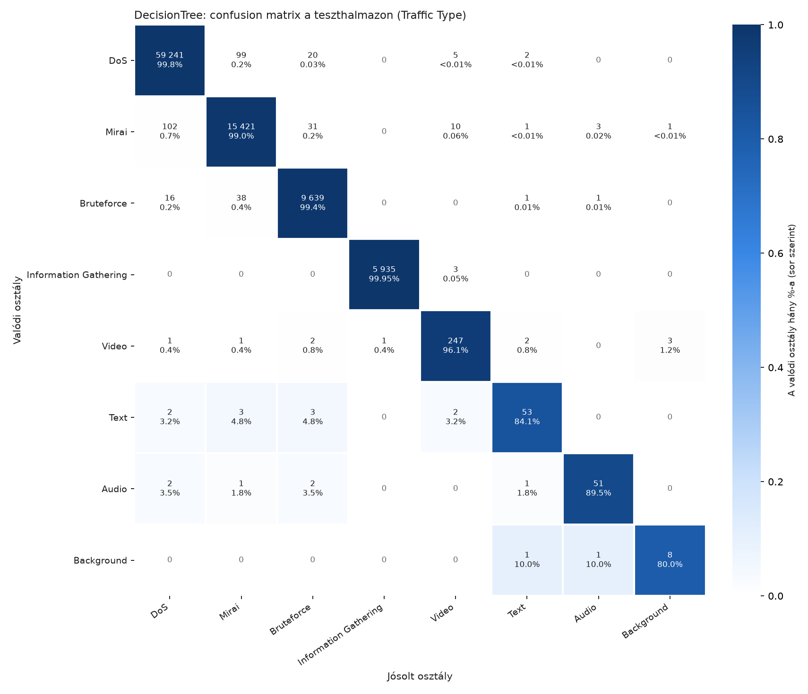
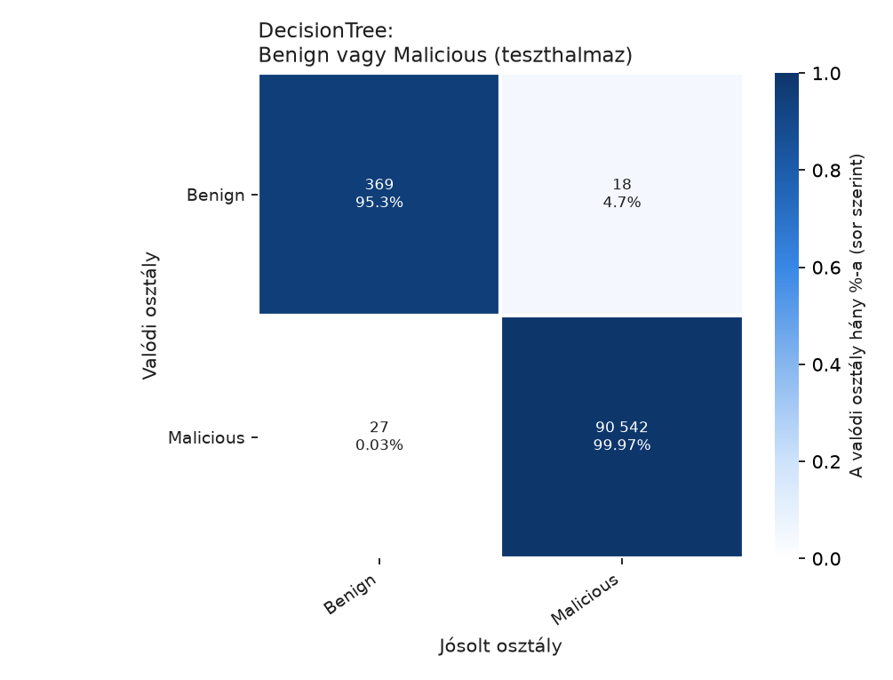

# 02 – Végső eredmények a teszthalmazon: DecisionTree (ML8)

A végső Pipeline a teljes train-halmazon tanult (212 230 sor, 2.4 s), majd **egyszer** futott a teszthalmazon (90 956 sor, jóslás 0.06 s). A teszthalmazt ezt megelőzően egyik lépés sem használta.

## 1. Összesített metrikák

| Metrika | Teszt | Train CV (hangolás) |
|---|---|---|
| **Macro F1** | **0.9262** | 0.9233 |
| Balanced accuracy | 0.9349 | – |
| Accuracy | 0.9960 | – |

A tárgy 70%-os accuracy-követelményét a modell teljesíti (99.60%), de ez önmagában nem bizonyító erejű: a teszthalmaz 65%-a DoS, a négy támadásosztály együtt 99% feletti. A fő metrika a macro F1, amely mind a 8 osztályt egyforma súllyal veszi figyelembe.

## 2. Osztályonkénti eredmények (Traffic Type)

| Traffic Type | Tesztsorok | Precision | Recall | F1 |
|---|---|---|---|---|
| DoS | 59367 | 0.998 | 0.998 | 0.998 |
| Mirai | 15569 | 0.991 | 0.990 | 0.991 |
| Bruteforce | 9695 | 0.994 | 0.994 | 0.994 |
| Information Gathering | 5938 | 1.000 | 0.999 | 1.000 |
| Video | 257 | 0.925 | 0.961 | 0.943 |
| Text | 63 | 0.869 | 0.841 | 0.855 |
| Audio | 57 | 0.911 | 0.895 | 0.903 |
| Background | 10 | 0.667 | 0.800 | 0.727 |

A cellák a valódi osztály (sor) hány százalékát mutatják az adott jósolt osztályban; az átló a recall.

### A leggyakoribb tévesztések

| Valódi | Jósolt | Sorok |
|---|---|---|
| Mirai | DoS | 102 |
| DoS | Mirai | 99 |
| Bruteforce | Mirai | 38 |
| Mirai | Bruteforce | 31 |
| DoS | Bruteforce | 20 |
| Bruteforce | DoS | 16 |
| Mirai | Video | 10 |
| DoS | Video | 5 |
| Mirai | Audio | 3 |
| Information Gathering | Video | 3 |

## 3. Benign vagy Malicious

A jósolt Traffic Type-ból levezetve (Audio, Background, Text, Video → Benign; a többi → Malicious).

| Label | Tesztsorok | Precision | Recall | F1 |
|---|---|---|---|---|
| Benign | 387 | 0.9318 | 0.9535 | 0.9425 |
| Malicious | 90569 | 0.9998 | 0.9997 | 0.9998 |

- Benign flow, amelyet támadásnak minősített (téves riasztás): **18**
- Támadás, amelyet benignnek minősített (kihagyott támadás): **27**

