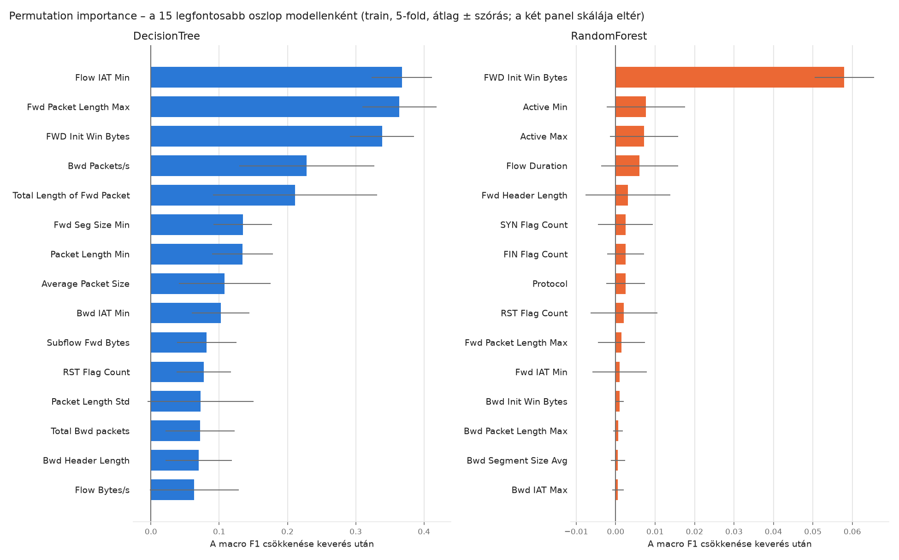

# 06 – Feature importance (ML9)

**Permutation importance:** egy oszlop értékeit véletlenszerűen összekeverjük, így az oszlop és a célváltozó kapcsolata megszűnik, és megmérjük, mennyit csökken a macro F1. Ha semmit, a modell nem használja érdemben az oszlopot.

**Hogyan mértem:** a **train-halmazon**, ugyanazzal az 5 folddal, mint az ML7-ben. Minden foldban a projekt végső Pipeline-ja (hangolt beállításokkal) 4 folddal tanult, és a fontosságot az ötödiken mértem, amelyet nem látott; oszloponként 5 keverés foldonként, összesen 25 érték átlaga és szórása. A teszthalmazt nem használtam. Ha a fontosságot a teljes train-halmazon tanult modell saját tanítóadatán mérném, az a „bemagolt” összefüggéseket is fontosnak mutatná.

## 1. A legfontosabb oszlopok

Mindkét modell 10 legfontosabb oszlopa, a két modell átlagos helyezése szerint rendezve. Az utolsó oszlop a RandomForest beépített (impurity alapú) fontossága összehasonlításként: ez gyorsan számolható, de a sok különböző értékkel bíró oszlopokat túlértékeli, és a tanítóadaton mér.

| Oszlop | DT rang | DT fontosság | RF rang | RF fontosság | RF impurity |
|---|---|---|---|---|---|
| FWD Init Win Bytes | 3 | 0.3384 ± 0.0468 | 1 | 0.0580 ± 0.0076 | 0.064 |
| Fwd Packet Length Max | 2 | 0.3640 ± 0.0542 | 10 | 0.0015 ± 0.0060 | 0.045 |
| RST Flag Count | 11 | 0.0774 ± 0.0401 | 9 | 0.0021 ± 0.0085 | 0.017 |
| Flow Duration | 18 | 0.0542 ± 0.0326 | 4 | 0.0061 ± 0.0097 | 0.037 |
| Active Min | 22 | 0.0430 ± 0.0324 | 2 | 0.0076 ± 0.0099 | 0.013 |
| Packet Length Min | 7 | 0.1342 ± 0.0444 | 20 | 0.0003 ± 0.0026 | 0.020 |
| Fwd Header Length | 26 | 0.0356 ± 0.0210 | 5 | 0.0031 ± 0.0108 | 0.032 |
| SYN Flag Count | 34 | 0.0206 ± 0.0269 | 6 | 0.0025 ± 0.0069 | 0.010 |
| Active Max | 40 | 0.0065 ± 0.0073 | 3 | 0.0072 ± 0.0087 | 0.019 |
| Bwd IAT Min | 9 | 0.1024 ± 0.0422 | 35 | -0.0003 ± 0.0058 | 0.016 |
| Protocol | 37 | 0.0184 ± 0.0365 | 8 | 0.0025 ± 0.0049 | 0.020 |
| Subflow Fwd Bytes | 10 | 0.0817 ± 0.0435 | 36 | -0.0003 ± 0.0041 | 0.018 |
| FIN Flag Count | 41 | 0.0054 ± 0.0058 | 7 | 0.0025 ± 0.0047 | 0.004 |
| Total Length of Fwd Packet | 5 | 0.2112 ± 0.1204 | 45 | -0.0020 ± 0.0052 | 0.039 |
| Bwd Packets/s | 4 | 0.2282 ± 0.0988 | 48 | -0.0039 ± 0.0045 | 0.020 |
| Flow IAT Min | 1 | 0.3675 ± 0.0442 | 54 | -0.0135 ± 0.0103 | 0.055 |
| Fwd Seg Size Min | 6 | 0.1345 ± 0.0428 | 51 | -0.0043 ± 0.0088 | 0.034 |
| Average Packet Size | 8 | 0.1080 ± 0.0673 | 49 | -0.0041 ± 0.0050 | 0.031 |

## 2. Hány oszlop hordozza a fontosságot?

| Modell | A pozitív fontosság 80%-a | 90%-a | 95%-a |
|---|---|---|---|
| DecisionTree | 19 oszlop | 27 oszlop | 32 oszlop |
| RandomForest | 5 oszlop | 8 oszlop | 12 oszlop |

Ellenőrzés: ugyanaz a modell csak a k legfontosabb oszloppal, 5-fold CV a train-halmazon (macro F1). Megjegyzés: a rangsort ugyanezeken a foldokon mértem, ezért a kis k-jú értékek enyhén optimisták lehetnek.

| Modell | Top 5 | Top 10 | Top 15 | Top 20 | Mind a 54 |
|---|---|---|---|---|---|
| DecisionTree | 0.7493 ± 0.0066 | 0.8204 ± 0.0207 | 0.8249 ± 0.0246 | 0.9175 ± 0.0209 | 0.9243 ± 0.0159 |
| RandomForest | 0.7603 ± 0.0243 | 0.9019 ± 0.0321 | 0.9089 ± 0.0294 | 0.9323 ± 0.0139 | 0.9180 ± 0.0195 |

**A zaj nagysága:** a „Mind” oszlop ugyanaz a modell, mint a hangolásnál, csak az oszlopok sorrendje más (fontossági sorrend). A RandomForest minden kérdésnél véletlenszerűen választ oszlopokat, ezért más sorrend más erdőt ad, és ez önmagában kb. 0,01 eltérést okozhat a macro F1-ben. Az ennél kisebb különbségek tehát zajnak tekintendők.

## 3. Összevetés az ML5 döntéseivel

- **Elhagyható jelöltek:** 28 oszlop fontossága mindkét modellben a zajon belül van (átlag − szórás ≤ 0): `Active Max`, `Active Std`, `Bwd Bulk Rate Avg`, `Bwd IAT Max`, `Bwd IAT Mean`, `Bwd IAT Total`, `Bwd Packet Length Max`, `Bwd Packet Length Min`, `Bwd Packet Length Std`, `Bwd Segment Size Avg`, `CWR Flag Count`, `Down/Up Ratio`, `ECE Flag Count`, `FIN Flag Count`, `Flow Bytes/s`, `Flow IAT Std`, `Fwd IAT Std`, `Fwd PSH Flags`, `Fwd URG Flags`, `Idle Std`, `PSH Flag Count`, `Packet Length Std`, `Packet Length Variance`, `Protocol`, `SYN Flag Count`, `Subflow Bwd Bytes`, `Total Length of Bwd Packet`, `URG Flag Count`.
- Ebből 1 oszlop átlagos fontossága is ≤ 0 mindkét modellben.
- **Az ML5-ben kihagyott korreláló oszlopok** megmaradt párja hol áll a rangsorban (54 oszlopból). Ha a megmaradt pár fontos, az mutatja, hogy az információt nem veszítettük el, csak a másolatot dobtuk ki:

| Kihagyott oszlop (ML5) | Megmaradt pár | DT rang | RF rang |
|---|---|---|---|
| Total Fwd Packet | Total Bwd packets (a(z) Subflow Fwd Packets oszlopon át) | 13 | 42 |
| Fwd Packet Length Min | Average Packet Size (a(z) Fwd Segment Size Avg oszlopon át) | 8 | 49 |
| Fwd Packet Length Mean | Average Packet Size (a(z) Fwd Segment Size Avg oszlopon át) | 8 | 49 |
| Bwd Packet Length Mean | Bwd Segment Size Avg | 29 | 14 |
| Flow Packets/s | Fwd Packets/s | 23 | 43 |
| Fwd IAT Total | Flow Duration | 18 | 4 |
| Packet Length Max | Fwd Packet Length Max | 2 | 10 |
| Packet Length Mean | Average Packet Size | 8 | 49 |
| ACK Flag Count | Bwd Header Length | 14 | 44 |
| Fwd Segment Size Avg | Average Packet Size | 8 | 49 |
| Bwd Packet/Bulk Avg | Bwd Bytes/Bulk Avg | 33 | 23 |
| Subflow Fwd Packets | Total Bwd packets | 13 | 42 |
| Subflow Bwd Packets | Total Bwd packets | 13 | 42 |
| Fwd Act Data Pkts | Total Length of Fwd Packet | 5 | 45 |
| Active Mean | Active Min | 22 | 2 |
| Idle Mean | Flow IAT Max | 19 | 17 |
| Idle Max | Flow IAT Max | 19 | 17 |
| Idle Min | Flow IAT Max (a(z) Idle Mean oszlopon át) | 19 | 17 |

- **A kihagyott azonosító oszlopok** (IP, port, Timestamp) nincsenek a modellben, így a fenti fontosságok kizárólag a forgalom viselkedését leíró jellemzőkből jönnek. Ez az ML5 egyik célja volt.
- **Flow IAT Min** (ML6, negatív értékek az Audio/Text osztályban): DT rang 1, RF rang 54.
- **Korlát:** ha két megmaradt oszlop még mindig erősen összefügg (|r| 0,90–0,95 között), a permutation importance mindkettőt alulbecsülheti, mert a modell a másikból pótolja a kevert oszlop információját.

## 4. Mit jelent ez?

- **A két modell egészen másképp használja az oszlopokat.** A DecisionTree-nél egy-egy oszlop összekeverése nagyot üt: a legfontosabb (`Flow IAT Min`) után a macro F1 0.37-dal esik. A RandomForestnél a legnagyobb esés is csak 0.058 (`FWD Init Win Bytes`). Az egyetlen fa minden döntési útvonala konkrét oszlopokra épül, ezért ha egy oszlop „elromlik”, az egész útvonal hibázik. A 100 fa véletlen oszlophalmazokkal tanult, így ugyanazt az információt sok különböző oszlopból is kiolvassa: ha egyet elveszünk, a többi pótolja. Ez a redundancia az RF stabilitásának oka.
- **Ezért az RF-nél a „nulla körüli fontosság” nem azt jelenti, hogy az oszlop haszontalan,** csak azt, hogy pótolható. Az elhagyható oszlopokról ezért nem a fontosság, hanem a top-k ellenőrzés dönt (2. pont): a 20 legfontosabb oszlop mindkét modellnél a teljes 54 oszlop eredményét hozza, a zajon belül.
- **`Flow IAT Min`:** a DecisionTree legfontosabb oszlopa (1. hely, 0.37), a RandomForestnél viszont az utolsó (54. hely, -0.014). Ez az az oszlop, amelynek negatív értékei az ML6-ban csak az Audio és a Text osztályban fordultak elő. A DT erősen támaszkodik rá, az RF egyáltalán nem igényli, vagyis az RF eredménye biztosan nem ezen a felvételi hibán múlik.
- **Összevetés az ML5-tel:** a korreláló párokból megtartott oszlopok több esetben a rangsor elején állnak (pl. `Fwd Packet Length Max`, `Average Packet Size`, `Flow Duration`), tehát a kihagyott másolatokkal nem veszett el információ. A top-k ellenőrzés szerint pedig az 54 oszlop tovább szűkíthető kb. 20-ra; ezt az ML5-ben nem tettük meg, de a „mit csinálnék másként” része lehet.
